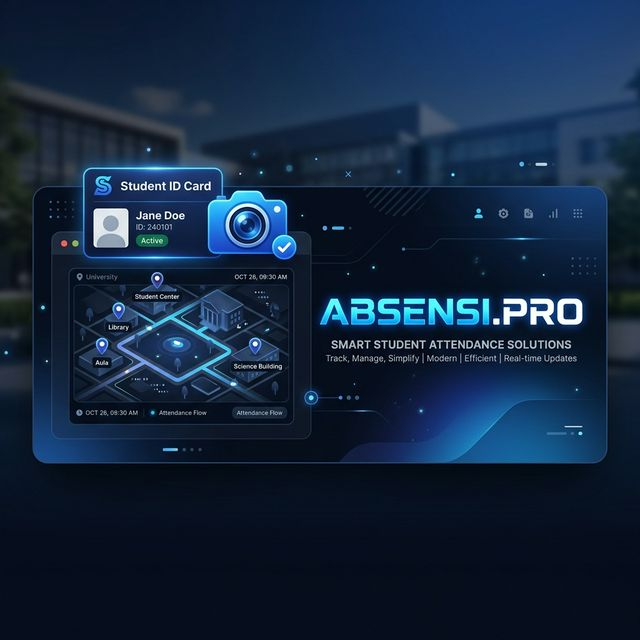

<div align="center">
  

  # 📍 Absensi.Pro
  ### *Smart Student Attendance System with Regional Geofencing*

  [](https://vitejs.dev/)
  [](https://reactjs.org/)
  [](https://supabase.com/)
  [](https://tailwindcss.com/)
</div>

---

## ✨ Overview
**Absensi.Pro** adalah solusi pencatatan kehadiran mahasiswa masa kini yang dirancang untuk **keamanan** dan **kemudahan**. Menggunakan verifikasi berbasis lokasi (Kecamatan Match) dan foto, aplikasi ini memastikan data kehadiran akurat dan sulit dimanipulasi.

## 🚀 Fitur Unggulan
- 🆔 **Registrasi Tanpa Ribet**: Cukup Nama & NPM, bebas dari hafalan password.
- 🌍 **Geofencing Cerdas (Kecamatan Match)**: Verifikasi lokasi yang lebih manusiawi berdasarkan nama wilayah.
- 📸 **Photo Verification**: Bukti kehadiran visual langsung terintegrasi ke Storage.
- ⚡ **Penyimpanan Kilat**: Menggunakan Supabase Storage untuk upload foto tanpa kendala.
- 📱 **Desain Premium**: Antarmuka modern, responsif, dan *eye-catching*.

## 🛠️ Tech Stack
- **Frontend**: Vite + React
- **Styling**: Tailwind CSS (Premium Dark Theme)
- **Maps & Geocoding**: Leaflet + Nominatim API
- **Backend & Storage**: Supabase (Postgres & Storage)

## 📦 Setup & Instalasi

### 1. Persiapan Database
Eksekusi query berikut di **Supabase SQL Editor** untuk menyiapkan tabel dan kebijakan akses:
👉 [supabase_schema.sql](./supabase_schema.sql)

### 2. Kloning & Install
```bash
# Clone repository
git clone https://github.com/your-username/absen.git

# Install dependencies
npm install
```

### 3. Konfigurasi Environment
Buat file `.env` di folder root:
```bash
VITE_SUPABASE_URL=https://your-project.supabase.co
VITE_SUPABASE_ANON_KEY=your-anon-key
```

### 4. Jalankan Lari!
```bash
npm run dev
```

## 📖 Cara Penggunaan
1.  **Daftar Mahasiswa**: Masuk ke menu `Register Student`, tentukan titik rumah, dan simpan.
2.  **Absen Harian**: Masuk ke menu `Attendance`, masukkan NPM, dan klik `Verify`.
3.  **Submit**: Jika sudah terverifikasi (Sesuai Kecamatan), ambil foto dan tekan `Submit Attendance`.

---
<div align="center">
  Built with passion ⚡ by Antigravity AI
</div>
